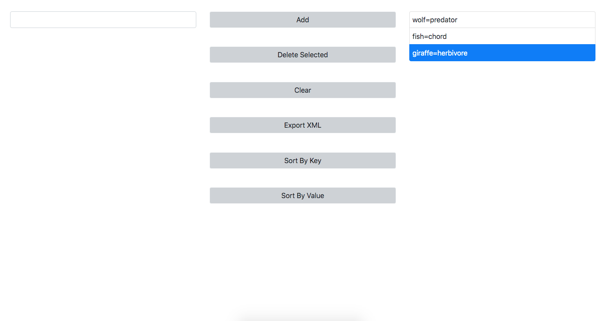

# Intern Assignmet for Rebel
Visit: please give 30sec for app to wake up  
https://key-value-to-xml.herokuapp.com/ 

A user-friendly single-page web application based on create-react-app to create <key>=<value> pairs and export it as XML file.

## Task

1. As a user I want to add a key/value pair to the list so I can build up my list.

    a. Key/value pairs must be in the format 'key'='value'

    b. Keys and value can only contain alpha-numeric characters
    
    c. The equal sign is used to delimit the pair
    d. Spaces before and after the equal sign should be ignored

2. As a user I want to remove a key/value pair from the list so I can remove ones I don’t want anymore.
    
    a. One key/value pair can be deleted at a time.

3. As a user I want to clear the key/value list so I can start over with an empty list.

    a. This resets the entire list to empty
    
    b. Clears the textbox as well

4. As a user I want to save my list to an xml file so I can use it in another application.

    a. Generate and start the xml file download
    b. Any reasonable xml format will suffice

5. As a user I want to sort the list by key so I can get a better look at the data.
    
    a. Alphabetical order on the key

6. As a user I want to sort the list by value so I can get a better look at the data.
    
    a. Alphabetical order on the value

## Technical Specifications
Stack: Node, JavaScript, React, Bootstrap, xml-js, file-saver

### Screenshot

## Getting Started
- cd into intern2019
- Run npm install
- To run server run NPM START

